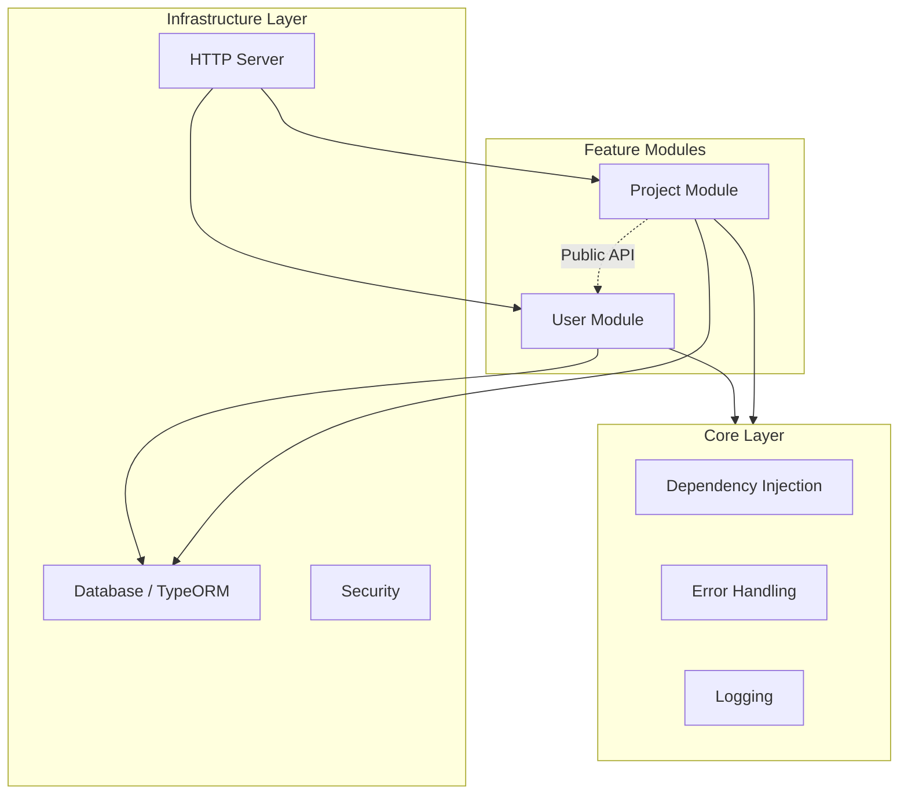
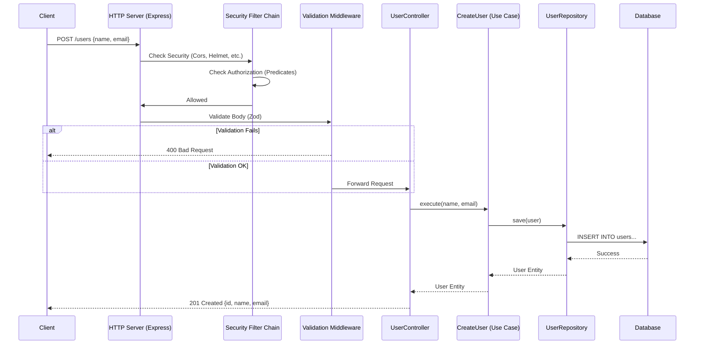
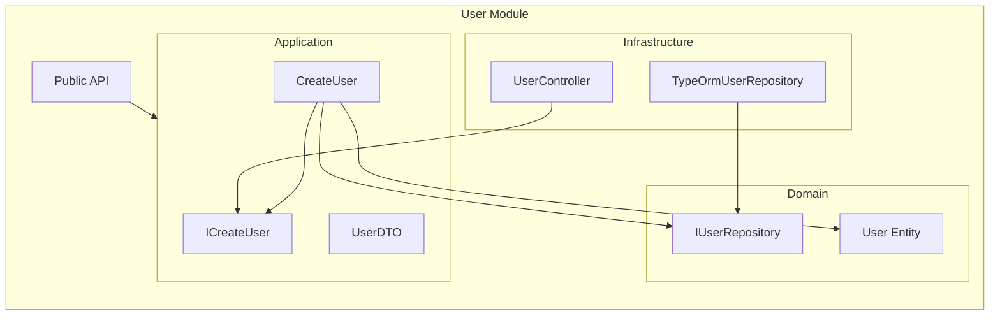

# Architecture Overview

This document details the architectural decisions and patterns used in the project.

## Clean Architecture Layers

This project implements **Clean Architecture** with the following layers:

### 1. Domain Layer (`modules/*/domain`)

**Purpose**: Business entities and rules

**Contains**:

- Entities (e.g., `User`)
- Repository interfaces (e.g., `IUserRepository`)
- Domain errors

**Dependencies**: None (pure business logic)

**Example**:

```typescript
// User.ts
export class User {
  constructor(
    public readonly id: string,
    public readonly name: string,
    public readonly email: string
  ) {}
}
```

### 2. Application Layer (`modules/*/application`)

**Purpose**: Use cases and business workflows

**Contains**:

- Use case implementations (e.g., `CreateUser`, `GetUserById`)
- Use case interfaces (e.g., `ICreateUser`)

**Dependencies**: Domain layer only

**Example**:

```typescript
// CreateUser.ts
@injectable()
export class CreateUser implements ICreateUser {
  constructor(@inject(TOKENS.UserRepository) private userRepository: IUserRepository) {}

  async execute(name: string, email: string): Promise<User> {
    const existingUser = await this.userRepository.findByEmail(email);
    if (existingUser) {
      throw new UserAlreadyExistsError(email);
    }
    const user = new User(randomUUID(), name, email);
    return this.userRepository.save(user);
  }
}
```

### 3. Infrastructure Layer (`modules/*/infrastructure`)

**Purpose**: External concerns (HTTP, DB, DI)

**Contains**:

- Controllers (HTTP handlers)
- Repository implementations (e.g., `TypeOrmUserRepository`)
- DI registries

**Dependencies**: Application and Domain layers

**Example**:

```typescript
// TypeOrmUserRepository.ts
export class TypeOrmUserRepository implements IUserRepository {
  private repository = AppDataSource.getRepository(UserEntity);

  async save(user: User): Promise<User> {
    const entity = new UserEntity();
    entity.id = user.id;
    entity.name = user.name;
    entity.email = user.email;
    await this.repository.save(entity);
    return user;
  }
}
```

### 4. Core Layer (`core/`)

**Purpose**: Cross-cutting concerns

**Contains**:

- DI tokens
- Base error classes
- Logging interfaces
- CLI utilities

**Dependencies**: None

## Dependency Flow

```
┌─────────────────┐
│  Infrastructure │ ──┐
└─────────────────┘   │
                      ▼
┌─────────────────┐   │
│   Application   │ ──┘
└─────────────────┘   │
                      ▼
┌─────────────────┐   │
│     Domain      │ ──┘
└─────────────────┘

        Core (Independent)
```

**Rule**: Inner layers never depend on outer layers.

## Module Communication

Modules can communicate using two complementary patterns:

### 1. Synchronous Communication via Public APIs

For **direct, synchronous** interactions, modules expose public APIs:

```typescript
// User module exposes IUserPublicApi
export interface IUserPublicApi {
  getUserById(id: string): Promise<UserPublicDto | null>;
}

// Project module depends on the interface
@injectable()
export class GetUserProjects {
  constructor(@inject(TOKENS.UserPublicApi) private userApi: IUserPublicApi) {}

  async execute(userId: string): Promise<Project[]> {
    const user = await this.userApi.getUserById(userId);
    // ...
  }
}
```

**Use when:**

- You need an immediate response
- The result is required to continue processing
- Direct module-to-module data retrieval

## Benefits

1. **Testability**: Use cases can be tested with mocks
2. **Flexibility**: Swap implementations (e.g., DB) without changing business logic
3. **Maintainability**: Clear separation of concerns
4. **Scalability**: Add new modules without affecting existing ones

### 2. Asynchronous Communication via Domain Events

For **decoupled, asynchronous** interactions, modules use domain events:

#### Event Bus

The `EventBus` is a centralized event dispatcher based on Node.js `EventEmitter`:

```typescript
// core/events/event-bus.ts
export class EventBus extends EventEmitter {
  emitEvent(event: DomainEvent) {
    this.emit(event.type, event.payload);
  }

  onEvent<T extends DomainEvent["type"]>(
    type: T,
    handler: (payload: Extract<DomainEvent, { type: T }>["payload"]) => void | Promise<void>
  ) {
    this.on(type, handler as any);
  }
}
```

#### Domain Events

Events are defined as discriminated unions in `core/events/domain-events.ts`:

```typescript
export type DomainEvent = {
  type: "user.created";
  payload: {
    userId: string;
    email: string;
  };
};
// Add more events here
```

#### Emitting Events

Use cases emit events after performing actions:

```typescript
@injectable()
export class CreateUser implements ICreateUser {
  constructor(
    @inject(TOKENS.UserRepository) private userRepository: IUserRepository,
    @inject(TOKENS.EventBus) private eventBus: EventBus
  ) {}

  async execute(name: string, email: string): Promise<User> {
    const user = new User(randomUUID(), name, email);
    const savedUser = await this.userRepository.save(user);

    this.eventBus.emitEvent({
      type: "user.created",
      payload: {
        userId: savedUser.id,
        email: savedUser.email,
      },
    });

    return savedUser;
  }
}
```

#### Listening to Events

Modules can create listeners that subscribe to events:

```typescript
@injectable()
export class OnUserCreated {
  constructor(
    @inject(TOKENS.EventBus) private eventBus: EventBus,
    @inject(TOKENS.Logger) private logger: ILogger
  ) {}

  setup() {
    this.eventBus.onEvent("user.created", this.handle.bind(this));
  }

  private async handle(payload: Extract<DomainEvent, { type: "user.created" }>["payload"]) {
    this.logger.info(`[Notification] Welcome email sent to ${payload.email}`);
  }
}
```

Listeners are initialized in the module's registry:

```typescript
// Notifications.registry.ts
@registry([
  {
    token: OnUserCreated,
    useClass: OnUserCreated,
  },
])
export class NotificationsRegistry {}

const listener = container.resolve(OnUserCreated);
listener.setup();
```

**Use when:**

- Action is not critical to the main flow
- Multiple modules need to react to the same event
- Implementing side effects (emails, notifications, analytics)
- Building audit trails

### Comparison: Public APIs vs Events

| Aspect                 | Public APIs       | Domain Events               |
| ---------------------- | ----------------- | --------------------------- |
| **Coupling**           | Direct dependency | Decoupled                   |
| **Response**           | Synchronous       | Asynchronous                |
| **Use Case**           | Data retrieval    | Side effects, notifications |
| **Return Value**       | Yes               | No                          |
| **Multiple Consumers** | One-to-one        | One-to-many                 |

> [!TIP]
> Use **Public APIs** when you need data immediately. Use **Events** when you want to notify other modules without creating dependencies.

## 🏗️ Modular Monolith Architecture

This project follows a **Modular Monolith** architecture, where the application is structured into independent modules that communicate via public APIs.

### High-Level Structure



### Request Walkthrough: `POST /users`

Here is the detailed flow of a request to create a user:



1.  **Request**: Client sends `POST /users`.
2.  **Security**: `SecurityFilterChain` applies global middleware (Helmet, CORS, RateLimit) and checks authorization predicates.
3.  **Routing**: Express matches the route.
4.  **Validation**: `validateRequest` middleware checks the body against `createUserSchema`.
5.  **Controller**: `UserController` receives the request and resolves the `CreateUser` use case from the DI container.
6.  **Use Case**: `CreateUser` executes business logic (e.g., check if email exists, create entity).
7.  **Repository**: `UserRepository` persists the entity to the database via TypeORM.
8.  **Response**: The created user is returned to the client.

## 🧱 Module Anatomy

Each module follows Clean Architecture internally:


